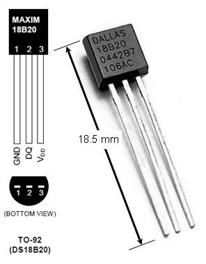

# DS18B20 Temperature Sensor

Code for getting started with a DS18B20 temperature sensor.

The DS18B20 digital thermometer provides 9-bit to 12-bit Celsius temperature measurements in the range -55°C to +125°C. The DS18B20 uses a 1-wire serial protocol. Multiple devices can share the same 1-wire bus as each device has a unique 64-bit serial code. The DS18B20 can be powered by a supply between 3.0V and 5.5V.

(Note, on some devices, pins 1 and 3 are switched.)

## Boards

Setup instructions and starter code for different development boards

| Board | Folder |
| --- | --- |
| Arduino Uno | [arduino-uno/](arduino-uno/) |
| Arduino MKR WiFi 1010 | For MKR WiFi 1010 follow instructions for Arduino Uno [arduino-uno/](arduino-uno/) |
| ESP32 | For ESP32 boards, follow instructions for ESP8266 [esp8266/](esp8266/) |
| ESP8266 | [esp8266/](esp8266/) |
| Raspberry Pi | [raspberry-pi/](raspberry-pi/) |
|  |  |

 

## Files/Folders

| File/Folder | Description |
|--- | --- |
| docs/DS18B20.pdf | Data sheet for sensor |

 

## Branches

**master**: main branch. currently not using other branches.

 

## References

* https://www.maximintegrated.com/en/app-notes/index.mvp/id/4377
