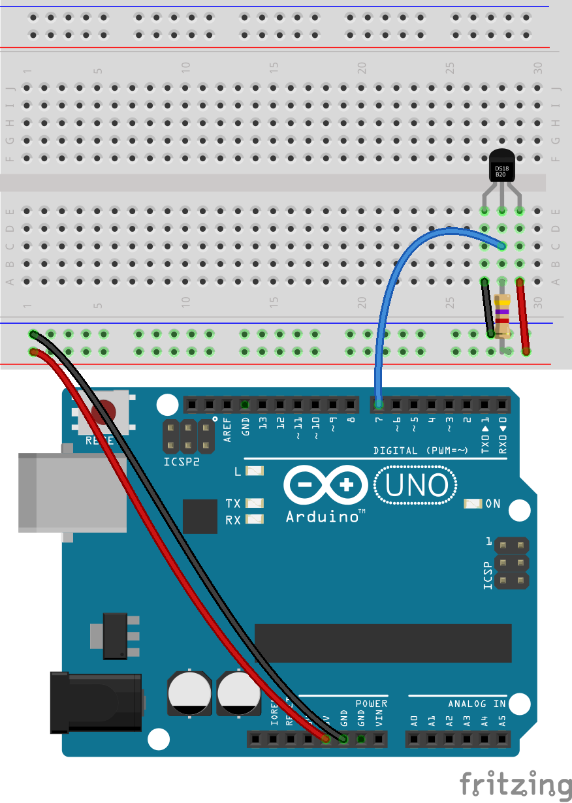
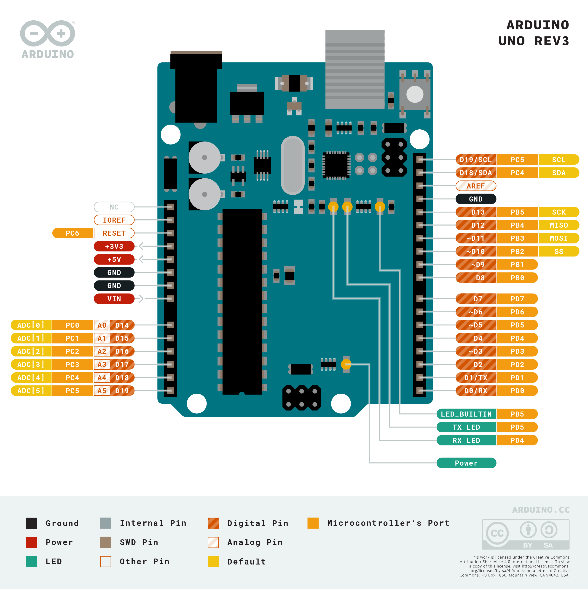

# Arduino Uno and DS18B20 Temperature Sensor

Setup instructions and starter code for using the DS18B20 temperature sensor and an Arduino development board.

 

## Files and Folders

| File/Folder | Description |
|--- | --- |
| arduino/ | Arduino projects folder |
| arduino/ds18b20-simple/ds18b20-simple.ino | Simpler arduino sketch using DallasTemperature library. |
| arduino/ds18b20-temperature-sensor/ds18b20-temperature-sensor.ino | Arduino sketch that only uses OneWire library. |
| mkr-wifi-1010-setup.md | Setup instructions for using an Arduino MKR WiFi 1010 dev board. |
|  |  |

 

## Setup

Setup instructions for an Arduino Uno board is below. For MKR WiFi 1010 based setup instructions see [mkr-wifi-1010-setup.md](mkr-wifi-1010-setup.md).

## Circuit Diagram
Wire the components as shown in the diagram. The data line needs to be pulled high using a 4k7 ohm resistor.

#### Components Needed
* DS18B20 temperature sensor
* 4k7 ohm resistor
* connecting wires
* arduino uno development board

 

 

### Default Pin Wiring

| Pin No | Function |  | Device Connection |
| --- | --- | --- | --- |
| 5V | +5V |  | Vdd |
| GND | GND |  | GND |
| D7 | digital 7 |  | DQ |
|  |  |  |  |

 

## Arduino

The sketch will work with many different types and chipset of board. To use an Arduino Uno, make sure to select the correct board in Boards Manager.

The arduino sketches require the OneWire and DallasTemperature libraries. They are included in the root additional-libraries folder. Afternatively, they can be downloaded through the Arduino libraries manager or from https://github.com/PaulStoffregen/OneWire and https://github.com/milesburton/Arduino-Temperature-Control-Library.

## References

* https://create.arduino.cc/projecthub/TheGadgetBoy/ds18b20-digital-temperature-sensor-and-arduino-9cc806
* https://playground.arduino.cc/Learning/OneWire/
* https://www.milesburton.com/Dallas_Temperature_Control_Library
