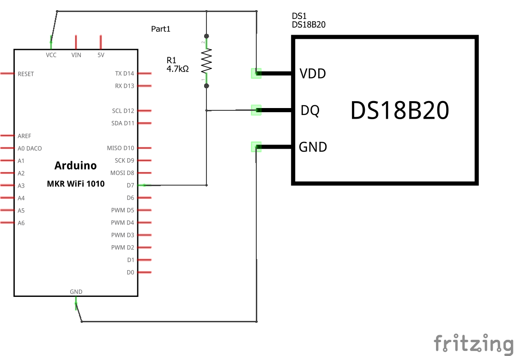

# Setup for MKR WiFi 1010 dev board

Setup instructions for an Arduino MKR WiFi 1010 development board.

## Circuit Diagram
Wire the components as shown in the diagram. The data line needs to be pulled high using a 4k7 ohm resistor.

#### Components Needed
* DS18B20 temperature sensor
* 4k7 resistor
* connecting wires
* MKR WiFi 1010 development board

 

 

### Default Pin Wiring

| Pin No | Function | Device Connection |
| --- | --- | --- |
|  |  |  |
| VCC | +3.3V | Vdd |
| GND | GND | GND |
| 7 | digital 7 | DQ |

<!--  TODO: pin out for mkr -->

 

## Arduino

Drivers and board details need to be installed to use the Arduino MKR series. Follow the instructions here: https://www.arduino.cc/en/Guide/MKRWiFi1010#toc2

The arduino sketch requires the OneWire and DallasTemperature libraries. They are included in the libraries folder.
