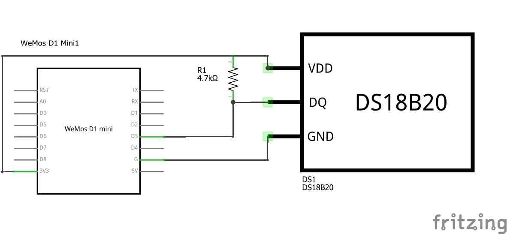
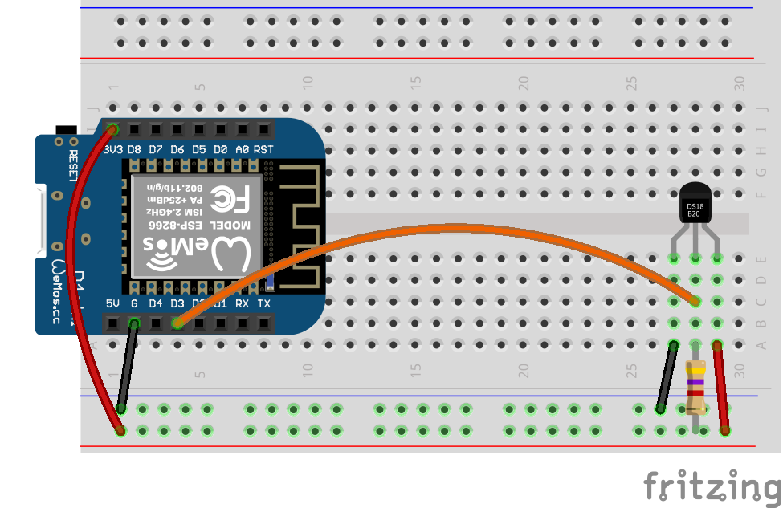

# ESP8266 and DS18B20 Temperature Sensor

 

Code for getting started with a DS18B20 temperature sensor using an ESP8266 or ESP32 development board.

<br>

## Files and Folders

| File/Folder | Description |
|--- | --- |
| [arduino/](arduino/) | Arduino projects folder |
| [arduino/ds18b20-simple/ds18b20-simple.ino](arduino/ds18b20-simple/ds18b20-simple.ino) | Simpler arduino sketch using DallasTemperature library. |
| [arduino/ds18b20-temperature-sensor/ds18b20-temperature-sensor.ino](arduino/ds18b20-temperature-sensor/ds18b20-temperature-sensor.ino) | Arduino sketch that only uses OneWire library. |
| [micropython/](micropython/) | MicroPython project folder |
| [micropython/temp_readings.py](micropython/temp_readings.py) | MicroPython script that reads the temperature value from the sensor and prints it to the REPL. |
| [esp32-setup.md](esp32-setup.md) | Setup instructions for using an ESP32 dev board. |
| [esp8266-micropython-setup.ps1](esp8266-micropython-setup.ps1) | PowerShell script to install MicroPython on ESP8266 device and upload scripts. |
|  |  |

<br>

## Branches

**master**: main branch. currently not using other branches.

<br>

## Setup

Setup instructions for ESP8266 boards is below. For ESP32 based setup instructions see [esp32-setup.md](esp32-setup.md).

## Circuit Diagram
Wire the components as shown in the diagram. The data line needs to be pulled high using a 4k7 ohm resistor.



#### Components Needed
* DS18B20 temperature sensor
* 4k7 resistor
* connecting wires
* esp8266 development board (e.g. Wemos D1 mini)

<br />



<br />

### Default Pin Wiring

| Pin No | Function |  | Device Connection |
| --- | --- | --- | --- |
| 3V3 | +3.3V |  | Vdd |
| G | GND |  | GND |
| D3 | GPIO 0 |  | DQ |
|  |  |  |  |


Further details and other board pin out diagrams can be found here: https://randomnerdtutorials.com/esp8266-pinout-reference-gpios/

<br>

## Arduino

The sketch will work with many different types and chipset of board. To use an ESP8266 board with Arduino, you will need to install the relevant board configuration files. Follow the instructions here: https://arduino-esp8266.readthedocs.io/en/latest/installing.html

The arduino sketches require the OneWire and DallasTemperature libraries. They are included in the root additional-libraries folder. Afternatively, they can be downloaded through the Arduino libraries manager or from https://github.com/PaulStoffregen/OneWire and https://github.com/milesburton/Arduino-Temperature-Control-Library.

## MicroPython

MicroPython already has drivers for OneWire and DS18X20 devices baked in. An additional help module is included in the [micropython/lib](micropython/lib) folder.

### Uploading Files

Test files can be uploaded using [ampy](https://learn.adafruit.com/micropython-basics-load-files-and-run-code/install-ampy).

```pwsh
PS> ampy --port <COM port of device> --baud 115200 put micropython/temp_readings.py
```

A PowerShell script ([esp8266-micropython-setup.ps1](esp8266-micropython-setup.ps1)) is also included to automatically setup MicroPython on an ESP8266 device.

```pwsh
PS> .\esp8266-micropython-setup.ps1
```

## References

- https://randomnerdtutorials.com/esp8266-pinout-reference-gpios/

* https://docs.micropython.org/en/latest/esp32/quickref.html#onewire-driver
* http://docs.micropython.org/en/v1.8.2/esp8266/esp8266/tutorial/onewire.html
* https://boneskull.com/micropython-on-esp32-part-1/
* http://www.esp32learning.com/code/esp32-and-ds18b20-temperature-sensor-example.php
* https://playground.arduino.cc/Learning/OneWire/
* https://www.milesburton.com/Dallas_Temperature_Control_Library
