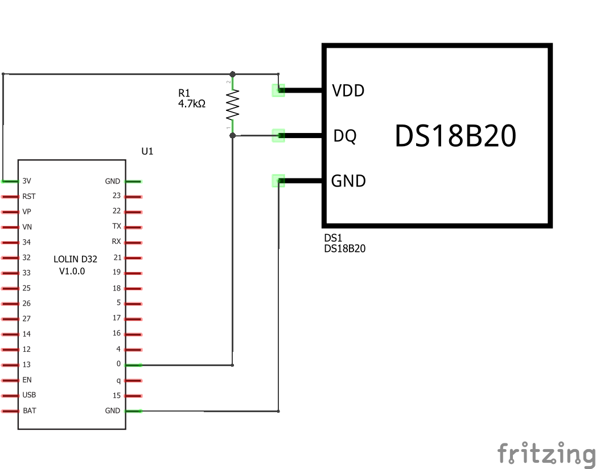
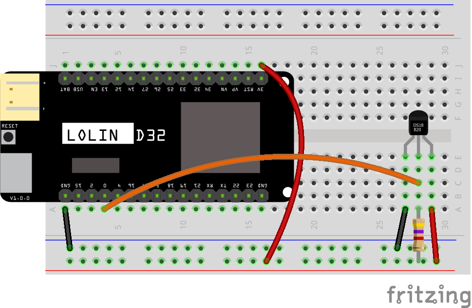
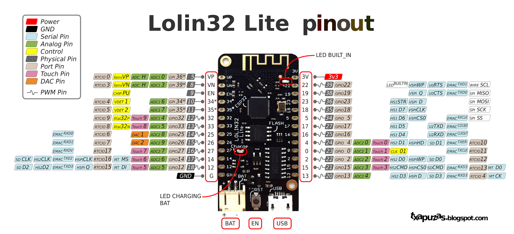

# Setup for ESP32 dev board

Setup instructions for an ESP32 based development board, like the Lolin D32.

## Circuit Diagram
Wire the components as shown in the diagram. The data line needs to be pulled high using a 4k7 ohm resistor.

#### Components Needed
* DS18B20 temperature sensor
* 4k7 resistor
* connecting wires
* esp32 development board

 

 

### Default Pin Wiring

| Pin No | Function | Device Connection |
| --- | --- | --- |
|  |  |  |
|  | +3.3V | Vdd |
|  | GND | GND |
|  | GPIO 0 | DQ |

 

## Arduino

The sketch will work with many different types and chipset of board. To use an ESP32 board with Arduino, you will need to install the relevant board configuration files. Follow the instructions here: https://github.com/espressif/arduino-esp32/blob/master/docs/arduino-ide/boards_manager.md

The arduino sketch requires the OneWire library. It is included in the libraries folder.

## MicroPython

MicroPython already has drivers for OneWire and DS18X20 devices baked in.
