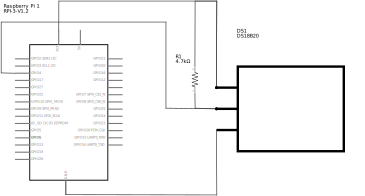
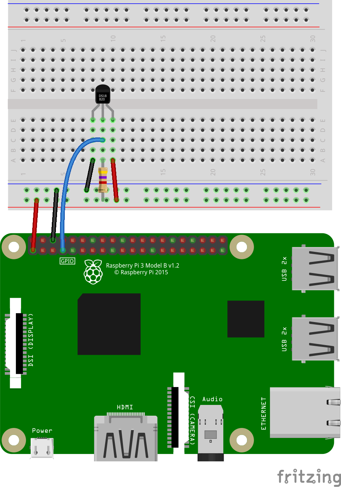

# DS18B20 Temperature Sensor

Code for getting started with a DS18B20 temperature sensor and a Raspberry Pi.

<br>

## Files and Folders

| File/Folder | Description |
|--- | --- |
| [python/](python/) | folder for python scripts. |
| [python/requirements.txt](python/requirements.txt) | Requirements file for python dependancy libraries. |
| [python/temperature.py](python/temperature.py) | python script that reads the temperature value from the sensor and prints it to the console. |
| [config.sh](config.sh) | Bash script to automatically configure and setup the Raspberry Pi for using the DS18B20 sensor. |
|  |  |

<br>

## Circuit Diagram
Wire the components as shown in the diagram.



#### Components Needed
* DS18B20 temperature sensor
* 4k7 resistor
* connecting wires
* raspberry pi

<br />



<br />

### Default Pin Wiring

| Pin No | Function |  | Device Connection |
| --- | --- | --- | --- |
| 1 | +3.3V |  | Vdd |
| 6 | GND |  | GND |
| 7 | GPIO 4 |  | DQ |
|  |  |  |  |


<br>

## Configure Raspberry Pi

The Raspberry Pi needs to have the 1-wire interface enabled and dependancy libraries need to be installed. Either follow the instructions below or run the config.sh script to automatically setup the Raspberry Pi.

```bash
chmod +x config.sh
./config.sh
```

### Install Python library
The python code uses a python library called w1thermsensor. To install this library type the following in a terminal.

```bash
sudo pip3 install w1thermsensor
```

A requirements.txt file is also provided and can be used instead.
```bash
cd ./python
sudo pip install -r requirements.txt
```

### Enable 1-wire communication

Open the raspi-config tool, found in preferences, or type the following in a terminal.
```bash
sudo raspi-config
```

Under interfaces, enable 1-wire interface. Click ok and reboot.

The default pin for 1-wire is pin 7 (GPIO 4). This can be changed in /boot/config.txt.

<br>

## References

- https://github.com/timofurrer/w1thermsensor
